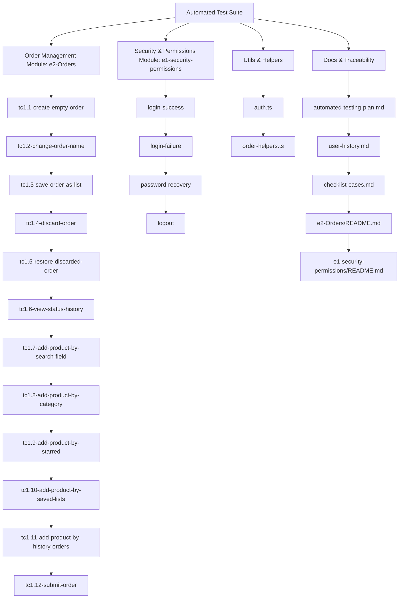

# 🧪 Automated Testing Plan

**QA Responsible:** [Responsible Name]  
**Automation Stack:** Playwright + MCP + GitHub Copilot + VS Code  
**Start Date:** [dd-mm-yyyy]  


---
🔗 For technical decisions, constraints, and rationale behind the automation strategy, see:  
[Technical Decisions and Considerations](../docs/testing-decisions.md)

## 🧪 Test Types and When to Apply

| Type               | When to Apply                | Cases                            |
|--------------------|-----------------------------|---------------------------------|
| **E2E Functional**  | After major UI/logic changes | `tc1.1`, `tc1.8`, `tc1.12`      |
| **UI Validation**   | During UI/form updates       | `tc1.12` field checks, buttons  |
| **Smoke Testing**   | Before staging/prod deploys  | `login-success`, `tc1.1`, `tc1.7` |
| **Regression**      | After each release/patch     | `e2-Orders`, `login`, `logout`  |
| **Negative Cases**  | When validating errors       | `tc1.12` missing data, `login-failure` |



---

## 🎯 Objective

Automate the critical flows of the web application to validate key functionalities, minimize manual errors, and ensure stability in every release.

---

## 🛠️ Tools

| Tool                | Purpose                                      |
|---------------------|----------------------------------------------|
| Playwright          | E2E test automation                          |
| MCP Server          | AI assistant for script generation           |
| GitHub Copilot      | AI code suggestions in VS Code               |
| VS Code Insiders    | Development environment                      |
| GitHub              | Version control and documentation            |

---

## 🔧 Technical Setup

- [x] Playwright installed (`npx playwright install`)
- [x] MCP configured (`@playwright/mcp`)
- [x] Codegen active (`npx playwright codegen`)
- [x] Videos enabled (`video: 'on'`)
- [x] Scripts organized by module and flow
- [x] Documentation linked to each test
- [x] Helper functions centralizados en `tests/utils/`
- [x] Validación de scripts en entorno de staging

---

## 🧩 Folder Structure

```
tests/
├── docs/
│   ├── automated-testing-plan.md
│   ├── user-history.md
│   └── checklist-cases.md
├── e2-Orders/
│   ├── README.md
│   ├── tc1.1-create-empty-order.spec.ts
│   ├── tc1.2-change-order-name.spec.ts
│   ├── tc1.2.1-restore-original-name.spec.ts
│   ├── tc1.3-save-order-as-list.spec.ts
│   ├── tc1.4-discard-order.spec.ts
│   ├── tc1.5-restore-discarded-order.spec.ts
│   ├── tc1.6-view-status-history.spec.ts
│   ├── tc1.7-add-product-by-search-field.spec.ts
│   ├── tc1.8-add-product-by-category.spec.ts
│   ├── tc1.9-add-product-by-starred.spec.ts
│   ├── tc1.10-add-product-by-saved-lists.spec.ts
│   ├── tc1.11-add-product-by-history-orders.spec.ts
│   ├── tc1.12-submit-order.spec.ts
│   └── [otros scripts]
├── e1-security-permissions/
│   ├── README.md
│   ├── login-success.spec.ts
│   ├── login-failure.spec.ts
│   ├── password-recovery.spec.ts
│   └── logout.spec.ts
├── utils/
│   ├── auth.ts
│   └── order-helpers.ts
└── .github/
    └── workflows/test.yml (optional CI)
```

---

## 🧪 Prioritized Test Cases

| ID                                   | Module                 | User Story | Priority | Status         |
|---------------------------------------|------------------------|------------|----------|---------------|
| tc1.1-create-empty-order              | Orders                 | US1        | High     | 🟢 Passed      |
| tc1.2-change-order-name               | Orders                 | US1        | High     | 🟢 Passed      |
| tc1.2.1-restore-original-name         | Orders                 | US1        | Medium   | 🟢 Passed      |
| tc1.3-save-order-as-list              | Orders                 | US1        | Medium   | 🟢 Passed      |
| tc1.4-cancel-order                    | Orders                 | US1        | High     | ⛔️ Removed     |
| tc1.4-discard-order                   | Orders                 | US1        | High     | 🟢 Passed      |
| tc1.5-restore-discarded-order         | Orders                 | US1        | Medium   | 🟢 Passed      |
| tc1.6-view-status-history             | Orders                 | US1        | Medium   | 🟢 Passed      |
| tc1.7-add-product-by-search-field     | Orders                 | US1        | High     | 🟢 Passed      |
| tc1.8-add-product-by-category         | Orders                 | US1        | High     | 🟢 Passed      |
| tc1.9-add-product-by-starred          | Orders                 | US1        | Medium   | 🟢 Passed      |
| tc1.10-add-product-by-saved-lists     | Orders                 | US1        | Medium   | 🟢 Passed      |
| tc1.11-add-product-by-history-orders  | Orders                 | US1        | Medium   | 🟢 Passed      |
| tc1.12-submit-order                   | Orders                 | US1        | High     | 🟢 Passed      |
| login-success                         | Security & Permissions | US2        | High     | 🟢 Passed      |
| login-failure                         | Security & Permissions | US2        | Medium   | 🟢 Passed      |
| password-recovery                     | Security & Permissions | US2        | Medium   | 🟢 Passed      |
| logout                                | Security & Permissions | US2        | Medium   | 🟢 Passed      |

---

## 📌 Success Criteria

- [x] Scripts run successfully without failures
- [x] Coverage of critical cases (login, orders, approval)
- [x] Videos generated and stored for each flow
- [x] Readable documentation traceable to user stories
- [x] Script validation in staging environment

---

## 🔄 Maintenance

- [x] Update scripts upon functional changes
- [x] Review flows weekly
- [x] Automate execution with GitHub Actions (optional)
- [x] Validate consistency with AI (Copilot + GPT)
- [x] Sincronización de documentación y scripts tras cada cambio relevante

---

## 📎 Notes

- This plan is adjusted based on new epics, critical bugs, or scope changes.
- User stories must include clear acceptance criteria and a functional validation checklist.
- Each script must be linked to its test case and corresponding user story for traceability.
- Utiliza helpers reutilizables y estructura modular para facilitar el mantenimiento.

---


📁 Document generated by: **Yannia More**  
📅 Last updated: `[10-07-2025]`

